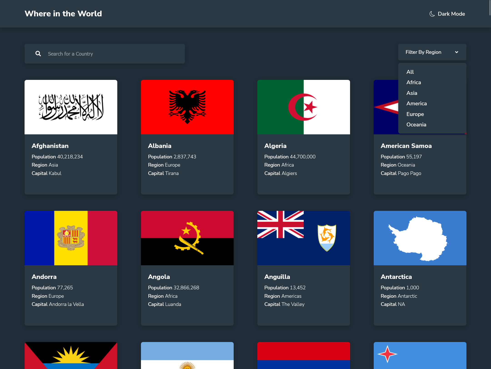
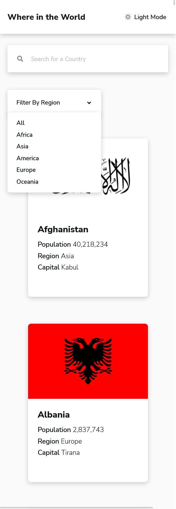

# Frontend Mentor - REST Countries API with color theme switcher solution

This is a solution to the [REST Countries API with color theme switcher challenge on Frontend Mentor](https://www.frontendmentor.io/challenges/rest-countries-api-with-color-theme-switcher-5cacc469fec04111f7b848ca). Frontend Mentor challenges help you improve your coding skills by building realistic projects. 

## Table of contents

- [Overview](#overview)
  - [The challenge](#the-challenge)
  - [Screenshot](#screenshot)
  - [Links](#links)
- [My process](#my-process)
  - [Built with](#built-with)
  - [What I learned](#what-i-learned)
- [Author](#author)
- [Acknowledgments](#acknowledgments)

## Overview

### The challenge

Users should be able to:

- See all countries from the API on the homepage
- Search for a country using an `input` field
- Filter countries by region
- Click on a country to see more detailed information on a separate page
- Click through to the border countries on the detail page
- Toggle the color scheme between light and dark mode *(optional)*

### Screenshot

### Links

- Solution URL: [Click to visit](https://github.com/Yehan20/Where-In-The-World)
- Live Site URL: [Click to visit](https://yn-where-in-the-world.netlify.app/)
- Challenge HUB: [Click to visit](https://www.frontendmentor.io/solutions/rest-countries-api-with-color-theme-switcher-NrClyzwArE)

## My process

### Built with

- Framer
- Flexbox
- Bem
- [React](https://reactjs.org/) - JS library
- [TypeScript](https://www.typescriptlang.org/) - Super Set of Js
- [Styled Components](https://styled-components.com/) - For styles

### Tools and technologies used

- Vitep
- Custom Hooks
- TS Interfaces
- React Router 6

### What I learned

My first project using react with type script, learnt a alot and gained lots of experience , mainly learnt to  use intefaces in type script and manage props that is been send to components and use them to add types. learnt use framer motion for animations. there was alot of modifiying the api data to a way to make it more easy to use

## Author

- Website - [portfolio](https://yehan-nilanga.netlify.app/)
- Frontend Mentor - [@Yehan20](https://www.frontendmentor.io/profile/Yehan20)
